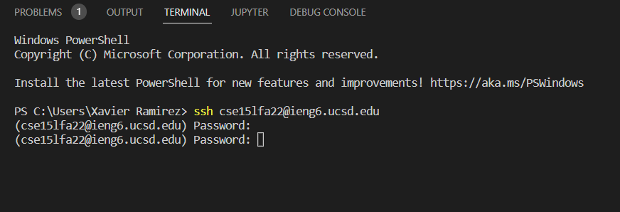
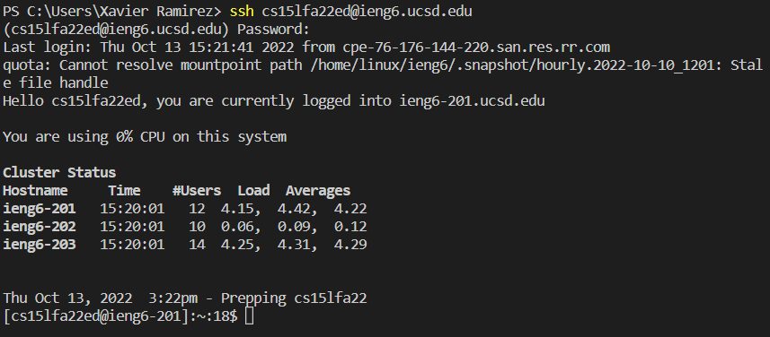
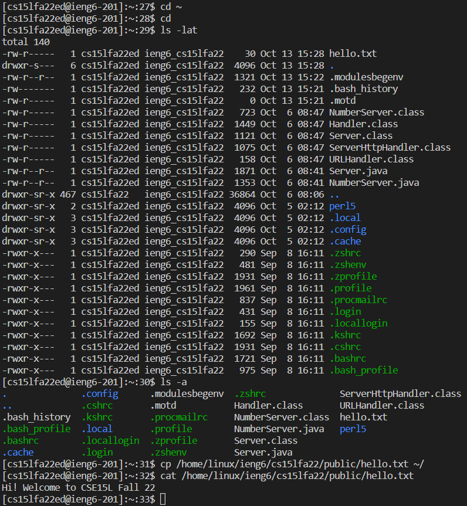
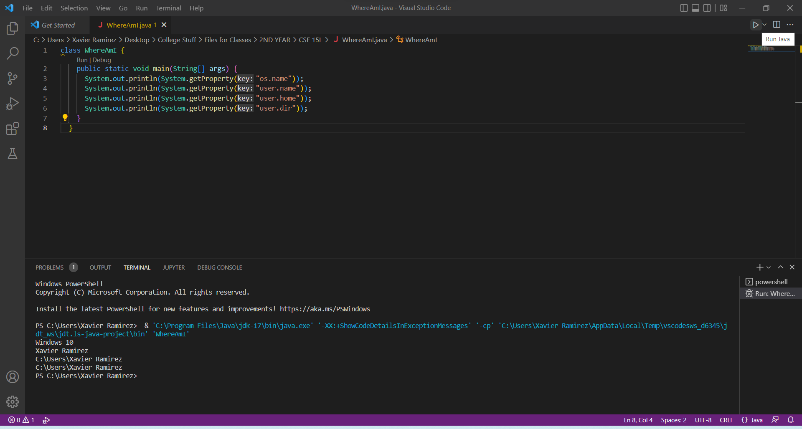
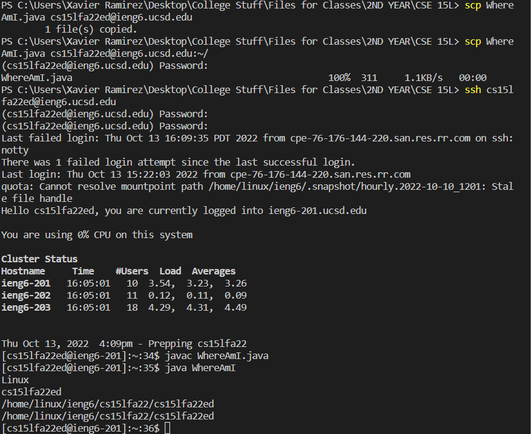
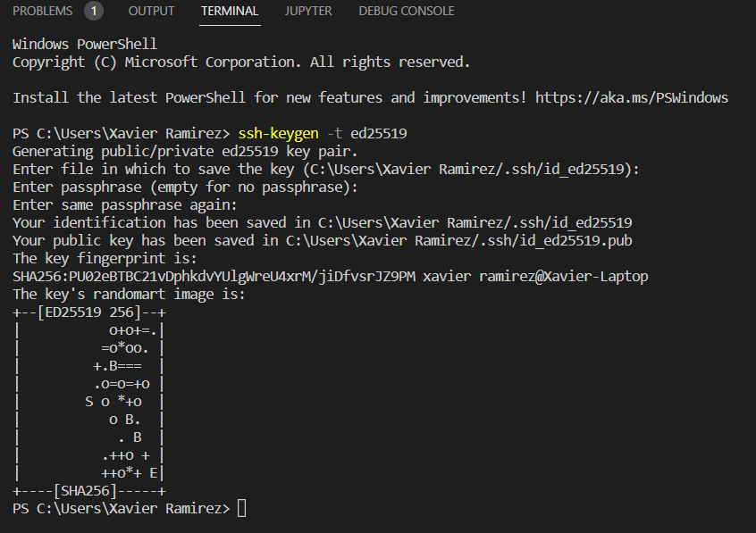
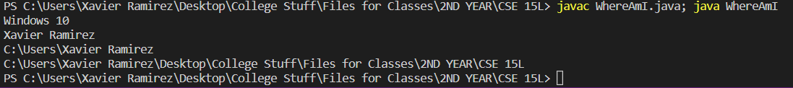

<h2>Installing VScode</h2>
To install VSCode, go to [the VSCode Website](https://code.visualstudio.com/) . Click on the big blue button to download and run the installer to install.

<h2>Remotely Connecting</h2>
To connect to the lab computers remotely, make sure that open ssh is installed on your windows device by going to settings > searching for "optional features" > checking from the dropdown list that both the "OpenSSH Client" and "OpenSSH Server" are installed.
Then, in VSCode, open a new terminal (by pressing "ctrl" + "~") and type in "ssh cs15lfa22**@ieng6.ucsd.edu" where the two asterisks are replaced with the two characters associated with your CSE 15L account (can be found at [this site](https://sdacs.ucsd.edu/~icc/index.php))
You should be able to enter in your account password. I (and many other of my peers) had trouble with this.

<h2>Trying Some Commands</h2>
Despite not being able to be remotely connected to the lab computers, I can still show you how to use some of the commands you will use! 
"cd" indicates that you will be updating the directory you are working in, adding more file paths after it moves you around your filesystem. Putting a tilde after it returns you to the home directory.
ls denotes linux commands. -lat displays a lot of files in the directory laterally, and -a displays all of them
cp is our way to copy files on the remote computers, and cat is a way to print out the contents of a given file

<h2>Moving Files with scp</h2>
scp is a way to securely copy files from one machine to another, which we will use to send a file from our system to the remote computer.
we're able to create, compile, and run a java file within vscode

We can compile and run it, and then next we will send it over to the computer by running the command "scp WhereAmI.java cs15lfa22zz@ieng6.ucsd.edu:~/". Then, we can run the files the same as we do on our systems, "javac WhereAmI.java" followed by "java WhereAmI".

<h2>Setting an SSH Key</h2>
We will copy over a public key to the remote computer in order to make copying files and logging in faster because we won't have to type in passwords every time. Just type in "ssh-keygen -t ed25519". It will ask you to enter a file location to save the keys, but pressing enter to use the default works fine. It will then ask for passwords, but setting no password also works fine here. After that, it will visualize everything it has generated, and you can see the files for the keys at the file folder you chose.

Then we will log into the remote computer and run the command "mkdir .ssh", and then exit. Back on our system, we will type in the command "scp /Users/*your user*/.ssh/*your filename*.pub cs15lfa22**@ieng6.ucsd.edu:~/.ssh/authorized_keys", replacing the user part of the path with your user, the filename with the public key file we just created, and your cs15l account id two characters. We'll have to type in the password one more time to connect and start the copying of the passwords, but that should be it for that.

<h2>OPTIMIZATIONS</h2>
The only thing left to show is optimizations. I can't show any related to logging in, but I can show how you can run multiple commands from the command line with a semicolon!

