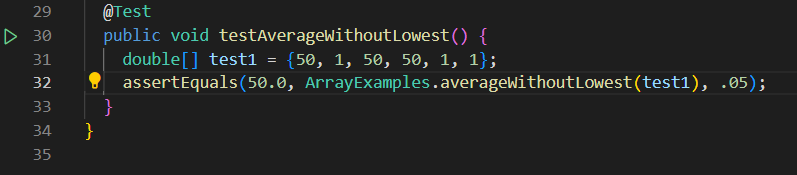
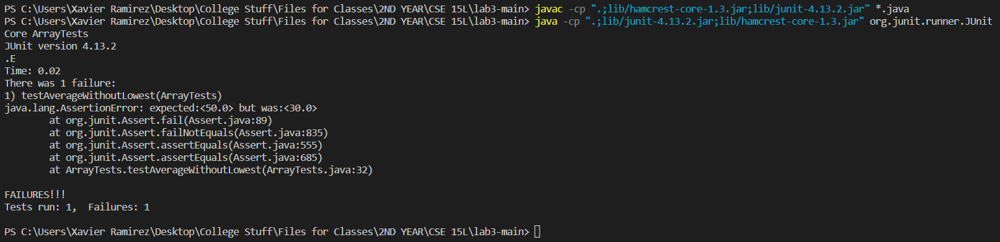
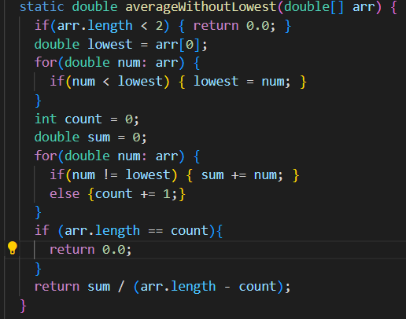
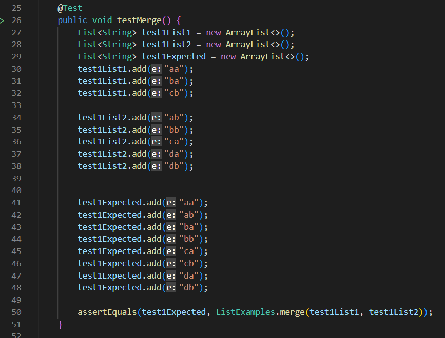
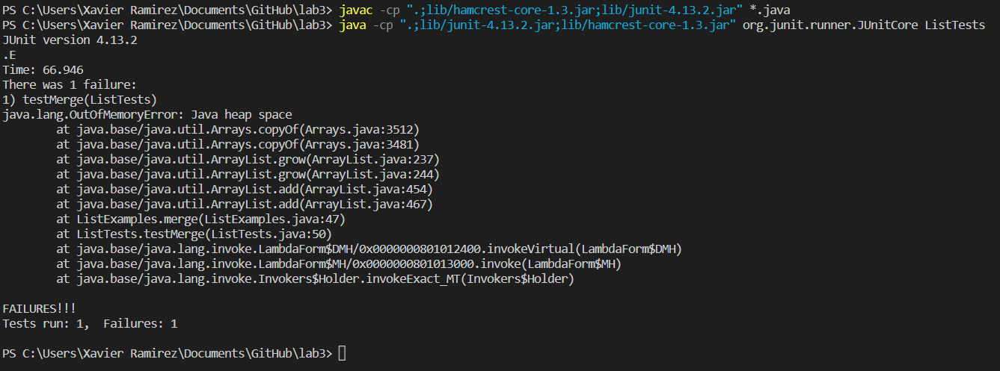
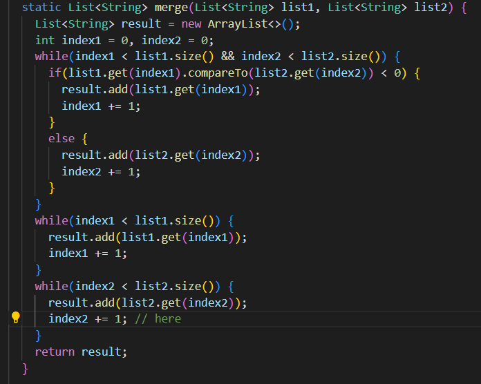

<h2>Part 1</h2>
~~~
import java.io.IOException;
import java.net.URI;
import java.util.ArrayList;

class Handler implements URLHandler {
    // The one bit of state on the server: a number that will be manipulated by
    // various requests.
    ArrayList<String> list = new ArrayList<String>();

    public String handleRequest(URI url) {
        if (url.getPath().equals("/")) {

            String result = list.toString();
            return result;
        } 
        else if (url.getPath().contains("/search")) {
            String[] parameters = url.getQuery().split("=");
            if (parameters[0].equals("s")) {
                ArrayList<String> foundList = new ArrayList<String>();
                for (int i = 0; i<list.size();i++){
                    if (list.get(i).contains(parameters[1])){
                        foundList.add(list.get(i));
                    }
                }
                String result = foundList.toString();
                return result; 
            }
            return "not valid";
        } 
        else {
            System.out.println("Path: " + url.getPath());
            if (url.getPath().contains("/add")) {
                String[] parameters1 = url.getQuery().split("=");
                if (parameters1[0].equals("s")) {
                    list.add(parameters1[1]);
                    return "added to list";
                }
            }
            return "404 Not Found!";
        }
    }
}
class SearchEngine {
    public static void main(String[] args) throws IOException {
        if(args.length == 0){
            System.out.println("Missing port number! Try any number between 1024 to 49151");
            return;
        }

        int port = Integer.parseInt(args[0]);

        Server.start(port, new Handler());
    }
}
~~~

The handleRequest method is called. Since the URL contains "/add", an array of strings is created called parameters1 and it is set equal to the array created by url.getQuery().split("="), which splits everything separated by an equals sign after the question mark character into strings and puts them into an array. The code then checks if the first input is the character "s", which we use to denote that we are adding the string after it in the URL. Since there is an "s" char, the string in the next index of parameters is added to the classes instance of a string array called list. We are of course adding the string we added in the URL.

Because the only thing added in the URL is a "/", a result string is created and set equal to the instance variable String list[], which contains all of the strings we've added, and calls the .toString() method on it. The result string is then returned.

Since the URL contained "/search", it does a similar thing to the last one where it makes a new array of strings that has the parts of the URL after the question mark and separated by equals sign in it, which it sets a variable called parameters to. It checks if the indicator char "s" is the first string in that new parameters array, and since it is, it creats a new ArrayList of strings to be the result that it will return eventually. It then goes through all of the elements in the instance variable list and checks if each one contains the string that is at the first index of the parameters. If each element of list does contain the parameter, then it will be added to the result list. Once they've all been gone through, it will set a string called result equal to the ArrayList of strings containing the string we're searching for, and then it will return that result.

<h2>Part 2</h2>

 (this is the setup to create an array that should have an average of 50, with multiple minimum values that should be removed)

 (this shows that the average is not what we expect it to be, being 30 instead of 50)

 (we fix the error in the method by changing when the method to count multiple minimum values in order to correctly ignore them in the final average calculation)
 The symptom show that the final sum that is used to calculate the average is not wrong, but that it is being divided by a greater number of inputs than it should be. This indicates that the total number of inputs considered is not decreasing as much as it should be. When we check that part of the code, we see that the total number of inputs that the final sum was being divided by was always the size of the input array minus one. We had multiple of the same minimum value in our particular input, all of which should have been removed from the sum (which they were) as well as removed from counting towards the total number of inputs to divide by. And since they weren't removed, the sum of the values besides the minimum was divided by a larger number, leading to a lower output. (To fix this, we simply counted how many times that minimum value showed up, then changed the total inputs to divide by to be the length of the original input array minus the number of times the minimum value showed up.)

 (here we create two lists with an easy to visualize outcome after the merge sorting method)

 (here we see a memory error, which indicated that memory is having problems, which is likely caused by looping through an array)

 (when checking the code for the method, we can see that we need to fix which index counter we are incrementing when one list is done being sorted and the second list has to add the rest of itself in order into the final array, we fix it to incrememnt the second array's index counter to not cause an infinite loop)
 The symptom of an infinite loops suggests that a loop is not updating its counter to reach its point of ending, therefore we check which values are being updated in the loops and what values are being checked as the condition of the loop. Then we see that the index value that is being increased in the loop that adds elements from the second list to the final resulting list is not the one that is being checked as the condition that ends the loop once it gets to the final index of the second input array. Since in our particular input we cause the first input array to add all of its values to the resulting array before the second input array does, we cause the program to enter the loop to add the rest of the values in the second array, which causes it to add the same value from the same index from the second list indefinetly, since the index that the loop is checking is never actually incrementing in the body of the loop.
