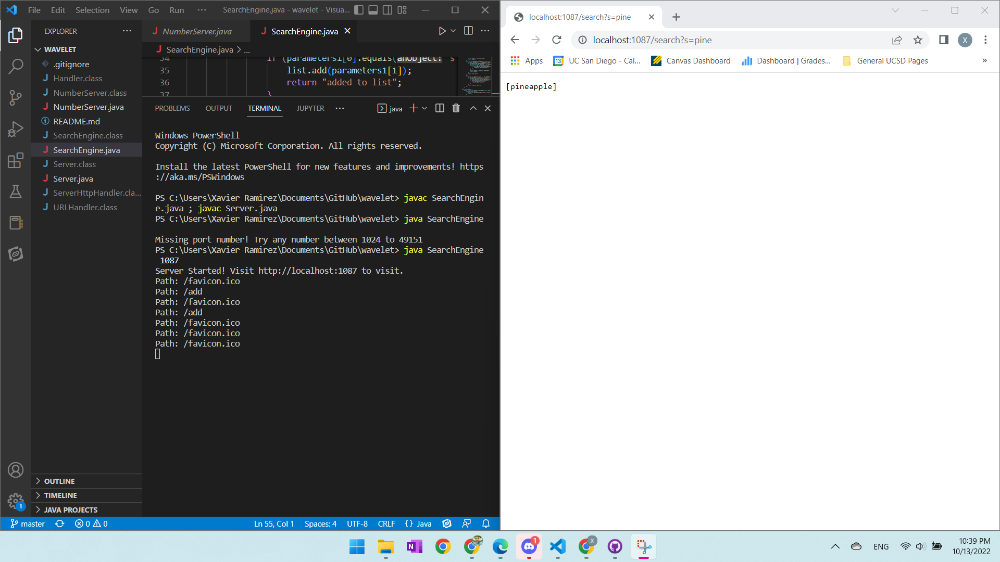

~~~
import java.io.IOException;
import java.net.URI;
import java.util.ArrayList;

class Handler implements URLHandler {
    // The one bit of state on the server: a number that will be manipulated by
    // various requests.
    ArrayList<String> list = new ArrayList<String>();

    public String handleRequest(URI url) {
        if (url.getPath().equals("/")) {

            String result = list.toString();
            return result;
        } 
        else if (url.getPath().contains("/search")) {
            String[] parameters = url.getQuery().split("=");
            if (parameters[0].equals("s")) {
                ArrayList<String> foundList = new ArrayList<String>();
                for (int i = 0; i<list.size();i++){
                    if (list.get(i).contains(parameters[1])){
                        foundList.add(list.get(i));
                    }
                }
                String result = foundList.toString();
                return result; 
            }
            return "not valid";
        } 
        else {
            System.out.println("Path: " + url.getPath());
            if (url.getPath().contains("/add")) {
                String[] parameters1 = url.getQuery().split("=");
                if (parameters1[0].equals("s")) {
                    list.add(parameters1[1]);
                    return "added to list";
                }
            }
            return "404 Not Found!";
        }
    }
}
class SearchEngine {
    public static void main(String[] args) throws IOException {
        if(args.length == 0){
            System.out.println("Missing port number! Try any number between 1024 to 49151");
            return;
        }

        int port = Integer.parseInt(args[0]);

        Server.start(port, new Handler());
    }
}
~~~

The handleRequest method is called. Since the URL contains "/add", an array of strings is created called parameters1 and it is set equal to the array created by url.getQuery().split("="), which splits everything separated by an equals sign after the question mark character into strings and puts them into an array. The code then checks if the first input is the character "s", which we use to denote that we are adding the string after it in the URL. Since there is an "s" char, the string in the next index of parameters is added to the classes instance of a string array called list. We are of course adding the string we added in the URL.

Because the only thing added in the URL is a "/", a result string is created and set equal to the instance variable String list[], which contains all of the strings we've added, and calls the .toString() method on it. The result string is then returned.

Since the URL contained "/search", it does a similar thing to the last one where it makes a new array of strings that has the parts of the URL after the question mark and separated by equals sign in it, which it sets a variable called parameters to. It checks if the indicator char "s" is the first string in that new parameters array, and since it is, it creats a new ArrayList of strings to be the result that it will return eventually. It then goes through all of the elements in the instance variable list and checks if each one contains the string that is at the first index of the parameters. If each element of list does contain the parameter, then it will be added to the result list. Once they've all been gone through, it will set a string called result equal to the ArrayList of strings containing the string we're searching for, and then it will return that result.
