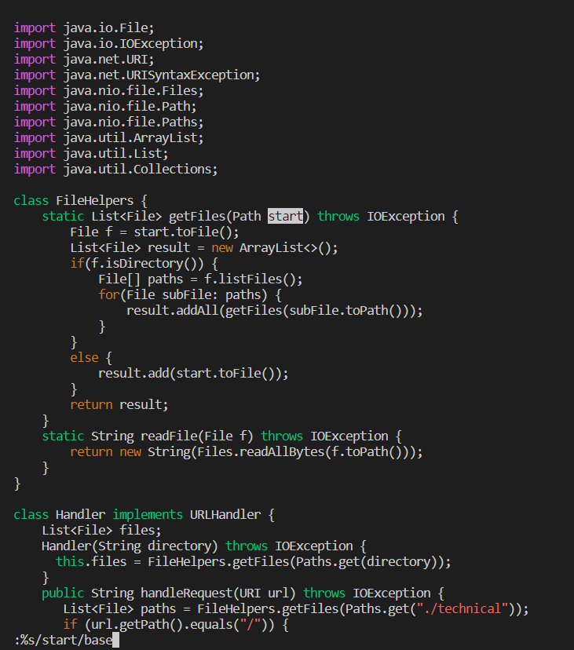
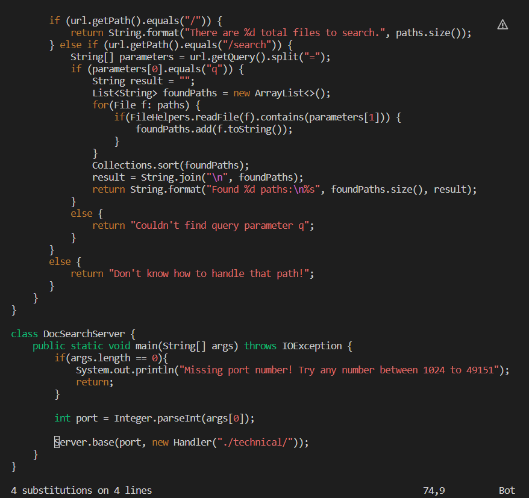
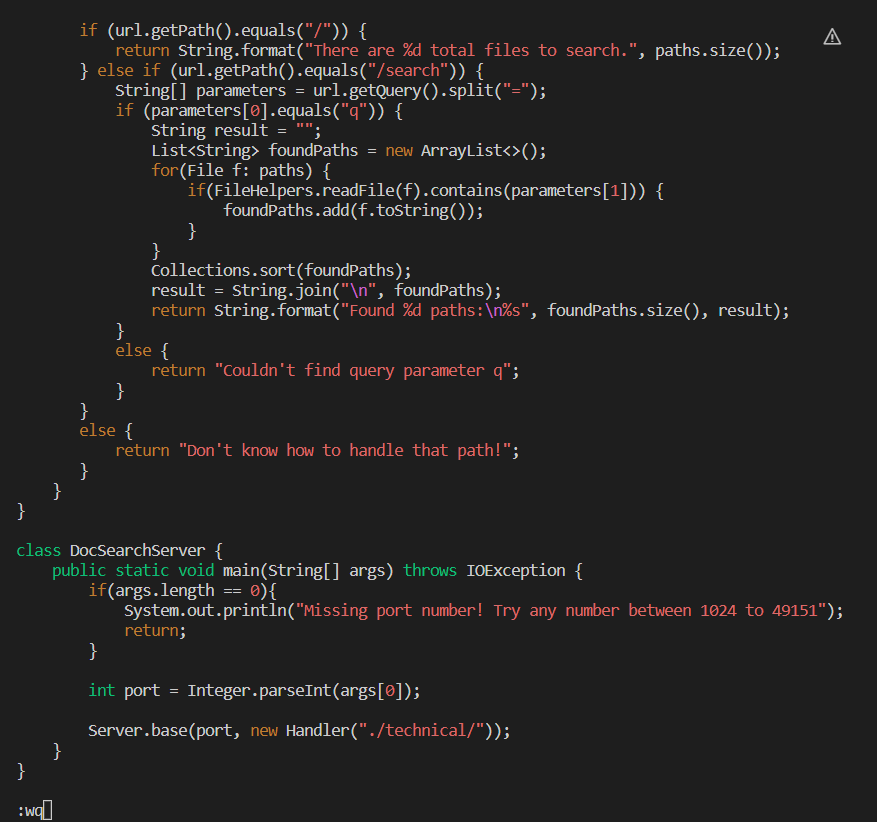
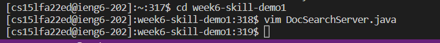

PART 1:
 
:%s/start/base/g<Enter>:wq<Enter>
 

:%s starts the subsitute command in the range of %, or the entire document. start is the first parameter and base is the second. g is a flag that signifies to replace specifically every occurance of start with base.
 
  
  <Enter> executes the command
 
  
:wq is the command to exit and save changes
 
  
the final <Enter> executes the command
 
     
     
PART 2:
     
    Working from my local computer to edit then scp copy them over then run it, it took me just over 6 minutes. I ran into problems making sure I had editied all of the correct characters in the file, then remembering the command to secure copy. Then when i transfered it over, I had to copy it into the correct directory to run the bash command to test it. All along the way, I had a few spelling errors that slowed me down.
    
    Working solely on the remote computers, I was able to get it all done in a minute and a half, which included going back to edit the .java file after I realized our string of inputs caused an error that made the tests not run. It was very easy and fast.
     
    Both methods have a lot of benefits. I think that if I were running a program remotely, I might still want to put up with copying over files since I get to use the IDE of my choice.
     
    I think this comes especially important when we think about the kind of tasks we're trying to complete, as well as the environment/situation we're trying to complete them in. For a particularly complex program or something I might not be able to fix problems in super intutitvely, I woudld definitely want VSCode to help me understand my problems, but for something simple like editing a few characters systematically in a document, remotely editing with vim is much easier. This could also come down to the situation of the project. If many collaborators are working together, having all updates constantly pushed to a remote server would be productive and befitting for the relatively smaller changes each person would make. However, a single-person project might just be better off making larger adjustments to their code and uploading it to test every once in a while, then maybe making small edits via vim.
