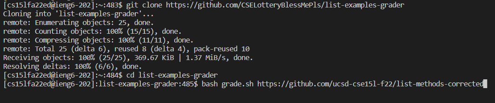
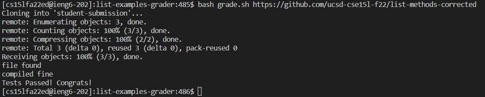
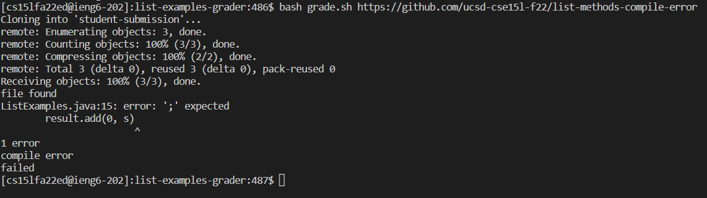
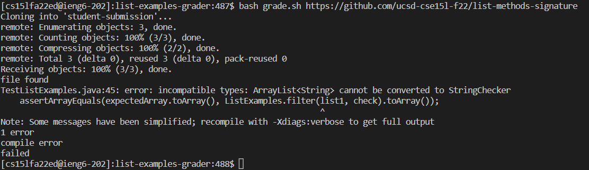

```
# Create your grading script here

#set -e

#clear the folder for each now run of the bash file
rm -rf student-submission 
#clone the repository to the root of the directory
git clone $1 student-submission
#copy the file TestListExamples.java into the main folder (that we just cloned everything into)
cp TestListExamples.java student-submission/
cp -r lib student-submission/
#change the directory into the foler
cd student-submission

#if ListExamples.java exists within the folder
if [[ -f ListExamples.java ]]
then #file found, move on
    echo "file found"
else #file not found, tell that, print the grade which is still zero, exit with the error exit code
    echo "file not found"
    echo "failed"
    exit 1
fi
#comple the java files, report the output to compile-out.txt
javac -cp ".:lib/hamcrest-core-1.3.jar:lib/junit-4.13.2.jar" *.java 2> compile-output.txt
#if no errors
if [[ $? -eq 0 ]]
then
    echo "compiled fine"
    java -cp ".:lib/junit-4.13.2.jar:lib/hamcrest-core-1.3.jar" org.junit.runner.JUnitCore TestListExamples > errors.txt
    ERROR=$(grep "FAILURES" errors.txt)
    if [[ $ERROR == "FAILURES!!!" ]]
    then
        echo "failed"
        echo "errors:"
        cat errors.txt
        exit 
    fi
    echo "Tests Passed! Congrats!"
    exit
else
    cat compile-output.txt
    echo "compile error"
    echo "failed"
    exit 1
fi
```

<br>
I currently don't have the ability to run the server through the browser, but I can show the process approximately running in the terminal.
 
 
 
 

<br>
I am showing the trace of this input https://github.com/ucsd-cse15l-f22/list-methods-compile-error
<br>
<br>

| LINE  | STDOUT | STDERR     | RETURN CODE  |
| -----  | ------   |    -------- | ------  |
| rm    |         |    | 0|
| git   |         | "Cloning into 'student-submission'... remote"...     |0 |
| cp    |         |    |0 |
| cp    |         |       |0 |
| cd    |         |    |0 |
| *if statement*   | *True because file called "ListExamples.java" is found in the current directory, student-submission*        |       | |
| echo  | "file found" |    | 0|
| echo  |*NOT RUN* | *NOT RUN*      | |
| echo  |*NOT RUN* | *NOT RUN*   | |
| exit  |*NOT RUN* | *NOT RUN*     | |
| javac |        | "ListExamples.java:15: error ';' expected result.add"...   | 1 |
| *if statement*   |    *False because there is error produced and the return code is currently 1*     |       | |
| echo  | *NOT RUN*| *NOT RUN*   | |
| java  | *NOT RUN*| *NOT RUN*      | |
| *initialize a variable*      | *NOT RUN*       | *NOT RUN*   | |
| *if statement*   | *NOT RUN*        | *NOT RUN*      | |
| echo  | *NOT RUN*| *NOT RUN*   | |
| echo  | *NOT RUN*| *NOT RUN*      | |
| cat   | *NOT RUN*| *NOT RUN*   | |
| exit  | *NOT RUN*| *NOT RUN*      | |
| echo  | *NOT RUN*| *NOT RUN*   | |
| exit  | *NOT RUN*| *NOT RUN*      | |
| cat   | "ListExamples.java:15: error ';' expected result.add"...       |    | 0|
| echo  | "compile error" |       | 0|
| echo  | "failed" |    |0 |
| exit  |         |       |1 |
